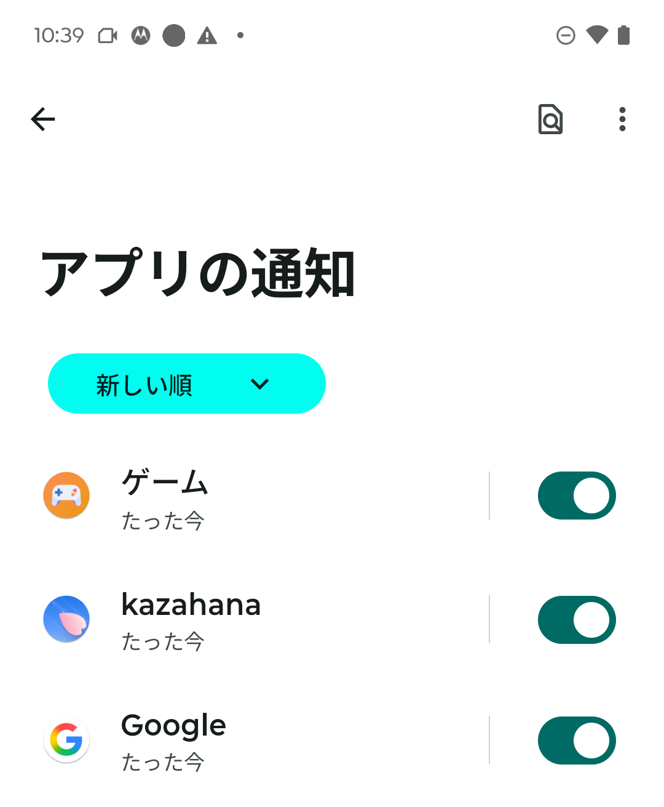
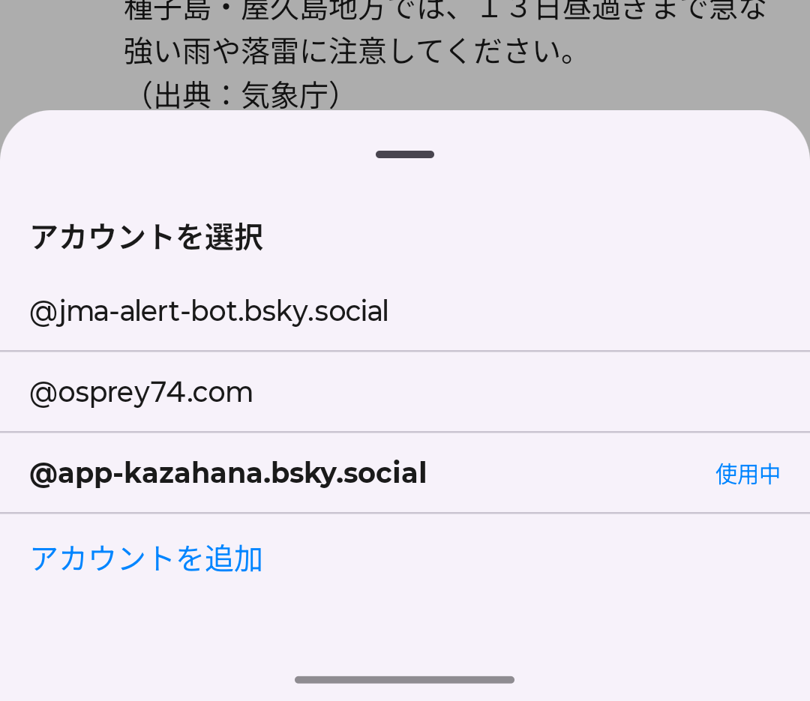

# kazahana Android 補足ガイド

このガイドでは、Android 版 kazahana に固有の機能について説明します。全プラットフォーム共通の機能（タイムライン、投稿、検索、通知、DM、プロフィール、設定、BSAF など）については、[デスクトップ版操作マニュアル](https://github.com/osprey74/kazahana/blob/main/docs/ja/guide/index.md)をご覧ください。

---

## 目次

- [プッシュ通知](#プッシュ通知)
- [他のアプリからの共有](#他のアプリからの共有)
- [Android 固有のナビゲーション](#android-固有のナビゲーション)
- [アカウント切り替え](#アカウント切り替え)
- [ディープリンク](#ディープリンク)
- [デスクトップ版との違い](#デスクトップ版との違い)

---

## プッシュ通知

Android 版 kazahana は、Firebase Cloud Messaging（FCM）を通じたプッシュ通知に対応しています。[kazahana-push-backend](https://github.com/osprey74/kazahana-push-backend) と連携して動作します。

### プッシュ通知を有効にする

1. kazahana の **設定** を開きます。
2. **プッシュ通知** のトグルをオンにします。
3. Android 13 以降では、システムの通知許可ダイアログが表示されるので **許可** をタップします。

オフにすると、デバイスがプッシュ通知サーバーから自動的に解除されます。

> **補足:** Android 12 以前では、通知権限はインストール時に付与されるため、追加のダイアログは表示されません。

通知の許可状態は、後から Android 本体の設定アプリ（アプリ → 通知 → アプリの通知）からも管理できます：

### 仕組み

- プッシュ通知を有効にすると、FCM トークンが kazahana プッシュ通知サーバーに自動登録されます。
- アカウントの新しいアクティビティが通知されます。
- 通知をタップすると通知タブが開きます。別のアカウント宛ての通知の場合、kazahana が自動的にそのアカウントに切り替えます。
- WorkManager によるバックグラウンドポーリングが約15分間隔で未読通知をチェックします。

---

## 他のアプリからの共有

他のアプリから kazahana にテキストや URL を共有できます。

### 共有の方法

1. 任意のアプリ（Chrome、他の SNS アプリなど）で **共有** ボタンをタップします。
2. 共有シートから **kazahana** を選択します。
3. kazahana の投稿作成画面が開き、共有テキスト/URL が自動入力されます。
4. テキストを編集し、必要に応じて画像を追加して **投稿する** をタップします。

### 共有できるコンテンツ

| コンテンツの種類 | 動作 |
|------------------|------|
| **URL** | URL が入力されます。ソースアプリがページタイトルを提供する場合、それも含まれます。 |
| **テキスト** | テキストがそのまま入力されます。 |

> **補足:** Android の共有シートからの画像共有には現在対応していません。画像を投稿するには、kazahana の投稿作成画面内のフォトピッカーを使用してください。

---

## Android 固有のナビゲーション

### ボトムナビゲーションバー

ボトムナビゲーションバーは Material 3 デザインで、5つのタブがあります：ホーム、検索、通知、メッセージ、プロフィール。

- **タブを再タップ** すると、更新してトップにスクロールします。
- 通知タブに未読件数のバッジが表示されます。

### ジェスチャー

| ジェスチャー | 操作 |
|------------|------|
| **下にスワイプ** | 現在のフィードを更新（プルトゥリフレッシュ） |
| **ピンチズーム** | 全画面画像の拡大/縮小 |
| **ダブルタップ** | 全画面画像の拡大 |
| **長押し+ドラッグ** | フィード管理でフィードの並び替え |

---

## アカウント切り替え

2つ以上のアカウントが保存されている場合、専用のアカウント切り替え機能が利用できます。

### 使い方

1. ホーム画面で上部の **アカウントハンドル**（`@yourhandle ▼`）をタップします。
2. ボトムシートが表示され、保存済みの全アカウントが一覧で表示されます。
3. アカウントをタップして切り替えます。アクティブなアカウントは太字で「Active」と表示されます。
4. **+ アカウントを追加** をタップして新しいアカウントを追加できます。

**設定 → アカウント** からもアカウントの管理が可能です。切り替えや **ログアウト** によるアカウントの削除ができます。

---

## ディープリンク

Android 版 kazahana は `kazahana://` URL と `https://bsky.app` リンクに対応しています。

| URL パターン | 動作 |
|-------------|------|
| `kazahana://profile/{ハンドル}` | ユーザーのプロフィールを表示 |
| `kazahana://post/{AT URI}` | 投稿スレッドを表示 |
| `kazahana://compose?text=...` | テキストを入力した状態で投稿画面を表示 |
| `kazahana://hashtag/{タグ}` | ハッシュタグを検索 |
| `https://bsky.app/profile/{ハンドル}` | ユーザーのプロフィールを表示 |
| `https://bsky.app/profile/{ハンドル}/post/{rkey}` | 投稿スレッドを表示 |

---

## デスクトップ版との違い

### Android のみの機能

| 機能 | 説明 |
|------|------|
| プッシュ通知 | FCM によるリアルタイム通知 |
| 共有インテント | 他のアプリから kazahana へのテキスト/URL 共有 |
| アカウント切り替えボトムシート | ホーム画面からのクイックアカウント切り替え |
| プルトゥリフレッシュ | 全画面で下スワイプによる更新 |
| バックグラウンドポーリング | WorkManager による通知の定期チェック |

### Android で利用できないデスクトップ機能

| 機能 | 理由 |
|------|------|
| ブックマークレット | Android では非対応 |
| OS 起動時の自動起動 | Android では非対応 |
| システムトレイへの最小化 | Android にはシステムトレイがないため |
| ウィンドウ管理 | Android アプリは全画面表示 |

### iOS 版との違い

| 機能 | iOS | Android |
|------|-----|---------|
| サポーターバッジ（課金） | あり | なし |
| 共有シートでの画像共有 | 対応 | テキスト/URLのみ |
| プッシュ通知トグル | iOS 設定アプリのみ | アプリ内設定 |
| アカウント切り替え | 設定画面のみ | ボトムシート＋設定画面 |
