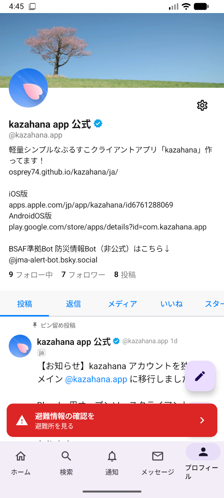
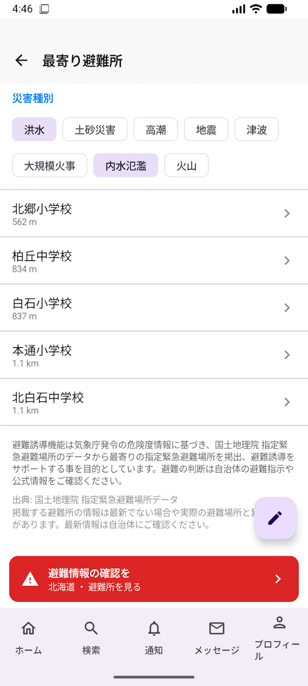
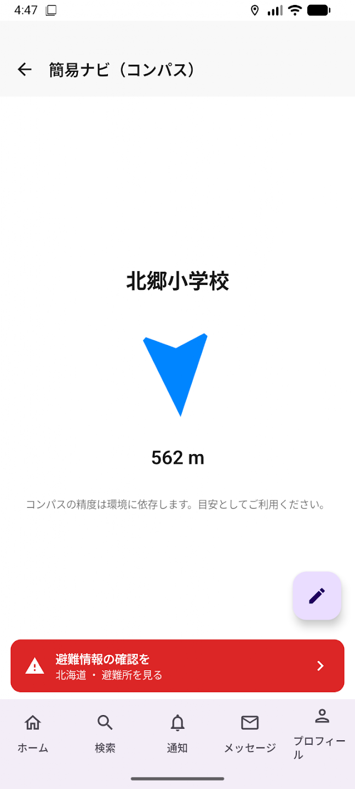

# kazahana Android 補足ガイド

このガイドでは、Android 版 kazahana に固有の機能について説明します。全プラットフォーム共通の機能（タイムライン、投稿、検索、通知、DM、プロフィール、設定、BSAF など）については、[デスクトップ版操作マニュアル](https://github.com/osprey74/kazahana/blob/main/docs/ja/guide/index.md)をご覧ください。

---

## 目次

- [避難所ナビ（避難誘導機能）](#避難所ナビ避難誘導機能)
- [プッシュ通知](#プッシュ通知)
- [他のアプリからの共有](#他のアプリからの共有)
- [Android 固有のナビゲーション](#android-固有のナビゲーション)
- [アカウント切り替え](#アカウント切り替え)
- [ディープリンク](#ディープリンク)
- [デスクトップ版との違い](#デスクトップ版との違い)

---

## 避難所ナビ（避難誘導機能）

v3.2.0 で追加された機能です。気象庁の警報級・危険度情報（bsaf-kikikuru-bot 経由）を検知すると、最寄りの避難所を案内します。避難所データ（国土地理院 指定緊急避難場所データ）はアプリに同梱されており、**通信がない状況でも利用できます**。

> **注意:** 本機能は気象庁の危険度情報に基づく補助であり、自治体の避難指示そのものではありません。避難の判断は自治体の避難指示や公式情報をご確認ください。

### 機能を有効にする

避難所ナビはデフォルトでオフになっています。以下の手順で有効にしてください：

1. **プロフィール** タブ → **設定** アイコンをタップします。
2. **避難誘導** セクションまでスクロールします。
3. **避難誘導機能を有効にする** トグルをオンにします。
4. bsaf-kikikuru-bot が未登録の場合、確認ダイアログが表示されます。**有効化する** をタップすると、bsaf-kikikuru-bot が自動的に BSAF 登録・フォローされます。

必要に応じて **都道府県（手動設定）** で自分の都道府県を選択できます。「自動（位置情報から判定）」のままにすると、位置情報から自動で判定されます。オフライン利用時は手動設定を推奨します。

### 警報バナー

避難誘導機能が有効な状態で、設定した都道府県（または現在地）に該当する気象警報情報を受信すると、画面下部に赤いバナーが表示されます。

- **レベル 3（黄色）**: 警報級の気象情報が出ています
- **レベル 4（赤色）**: 避難情報の確認を
- **レベル 5（ピンク）**: 直ちに安全確保を

バナーの **避難所を見る** をタップすると、最寄り避難所の一覧に遷移します。警報が解除されるか、6時間経過するとバナーは自動的に消えます。

### 最寄り避難所一覧

現在地から近い順に避難所が一覧表示されます。各避難所には直線距離が表示されます。

画面上部の **災害種別** チップ（洪水・土砂災害・高潮・地震・津波・大規模火事・内水氾濫・火山）で表示する避難所をフィルタできます。受信した警報の種類に応じて、自動的に適切なフィルタが設定されます。

避難所をタップすると詳細画面に遷移し、**地図アプリでナビ**（Google マップなどの地図アプリによる徒歩ナビ）または **簡易ナビ（コンパス）** を選択できます。

### 簡易ナビ（コンパス）

通信がなくても使えるコンパスベースのナビゲーションです。端末の磁気センサを利用し、選択した避難所の方向を矢印で、直線距離をリアルタイムで表示します。

- 矢印が示す方向に歩くと距離が減少していきます。
- 磁気センサの精度が低い場合は、端末を8の字に動かしてキャリブレーションしてください。
- オフライン時は地図アプリのナビが利用できないため、この簡易ナビが主な手段となります。

### オフライン利用

避難所データはアプリに同梱されているため、機内モードでも以下の操作が可能です：

| 操作 | オフライン |
|------|-----------|
| 最寄り避難所一覧の表示 | 可能 |
| 簡易ナビ（コンパス） | 可能 |
| 地図アプリでナビ | 不可（通信が必要） |
| 都道府県の自動判定 | 不可（手動設定が必要） |

> **補足:** 避難所データの出典は国土地理院 指定緊急避難場所データです。最新でない場合や実際の避難場所と異なる場合があります。最新情報は自治体にご確認ください。

### デモモード（動作確認）

災害情報が発令されていない平常時でも、避難所ナビの動作を確認できます。

1. **設定** 画面を開きます。
2. 画面下部の **バージョン番号を5回タップ** します。
3. 避難誘導セクションにデモ用のボタンが表示されます。
4. デモボタンをタップすると、警報バナーの表示や避難所一覧への遷移を実際に試すことができます。

> **補足:** デモモードで表示されるバナーはテスト用です。実際の気象警報とは関係ありません。
---

## プッシュ通知

Android 版 kazahana は、Firebase Cloud Messaging（FCM）を通じたプッシュ通知に対応しています。[kazahana-push-backend](https://github.com/osprey74/kazahana-push-backend) と連携して動作します。

### プッシュ通知を有効にする

1. kazahana の **設定** を開きます。
2. **プッシュ通知** のトグルをオンにします。
3. Android 13 以降では、システムの通知許可ダイアログが表示されるので **許可** をタップします。

オフにすると、デバイスがプッシュ通知サーバーから自動的に解除されます。

> **補足:** Android 12 以前では、通知権限はインストール時に付与されるため、追加のダイアログは表示されません。

通知の許可状態は、後から Android 本体の設定アプリ（アプリ → 通知 → アプリの通知）からも管理できます：

### 仕組み

- プッシュ通知を有効にすると、FCM トークンが kazahana プッシュ通知サーバーに自動登録されます。
- アカウントの新しいアクティビティが通知されます。
- 通知をタップすると通知タブが開きます。別のアカウント宛ての通知の場合、kazahana が自動的にそのアカウントに切り替えます。
- WorkManager によるバックグラウンドポーリングが約15分間隔で未読通知をチェックします。

---

## 他のアプリからの共有

他のアプリから kazahana にテキストや URL を共有できます。

### 共有の方法

1. 任意のアプリ（Chrome、他の SNS アプリなど）で **共有** ボタンをタップします。
2. 共有シートから **kazahana** を選択します。
3. kazahana の投稿作成画面が開き、共有テキスト/URL が自動入力されます。
4. テキストを編集し、必要に応じて画像を追加して **投稿する** をタップします。

### 共有できるコンテンツ

| コンテンツの種類 | 動作 |
|------------------|------|
| **URL** | URL が入力されます。ソースアプリがページタイトルを提供する場合、それも含まれます。 |
| **テキスト** | テキストがそのまま入力されます。 |

> **補足:** Android の共有シートからの画像共有には現在対応していません。画像を投稿するには、kazahana の投稿作成画面内のフォトピッカーを使用してください。

---

## Android 固有のナビゲーション

### ボトムナビゲーションバー

ボトムナビゲーションバーは Material 3 デザインで、5つのタブがあります：ホーム、検索、通知、メッセージ、プロフィール。

- **タブを再タップ** すると、更新してトップにスクロールします。
- 通知タブに未読件数のバッジが表示されます。

### ジェスチャー

| ジェスチャー | 操作 |
|------------|------|
| **下にスワイプ** | 現在のフィードを更新（プルトゥリフレッシュ） |
| **ピンチズーム** | 全画面画像の拡大/縮小 |
| **ダブルタップ** | 全画面画像の拡大 |
| **長押し+ドラッグ** | フィード管理でフィードの並び替え |

---

## アカウント切り替え

2つ以上のアカウントが保存されている場合、専用のアカウント切り替え機能が利用できます。

### 使い方

1. ホーム画面で上部の **アカウントハンドル**（`@yourhandle ▼`）をタップします。
2. ボトムシートが表示され、保存済みの全アカウントが一覧で表示されます。
3. アカウントをタップして切り替えます。アクティブなアカウントは太字で「Active」と表示されます。
4. **+ アカウントを追加** をタップして新しいアカウントを追加できます。

**設定 → アカウント** からもアカウントの管理が可能です。切り替えや **ログアウト** によるアカウントの削除ができます。

---

## ディープリンク

Android 版 kazahana は `kazahana://` URL と `https://bsky.app` リンクに対応しています。

| URL パターン | 動作 |
|-------------|------|
| `kazahana://profile/{ハンドル}` | ユーザーのプロフィールを表示 |
| `kazahana://post/{AT URI}` | 投稿スレッドを表示 |
| `kazahana://compose?text=...` | テキストを入力した状態で投稿画面を表示 |
| `kazahana://hashtag/{タグ}` | ハッシュタグを検索 |
| `https://bsky.app/profile/{ハンドル}` | ユーザーのプロフィールを表示 |
| `https://bsky.app/profile/{ハンドル}/post/{rkey}` | 投稿スレッドを表示 |

---

## デスクトップ版との違い

### Android のみの機能

| 機能 | 説明 |
|------|------|
| 避難所ナビ | 気象警報時に最寄り避難所を案内（オフライン対応） |
| プッシュ通知 | FCM によるリアルタイム通知 |
| 共有インテント | 他のアプリから kazahana へのテキスト/URL 共有 |
| アカウント切り替えボトムシート | ホーム画面からのクイックアカウント切り替え |
| プルトゥリフレッシュ | 全画面で下スワイプによる更新 |
| バックグラウンドポーリング | WorkManager による通知の定期チェック |

### Android で利用できないデスクトップ機能

| 機能 | 理由 |
|------|------|
| ブックマークレット | Android では非対応 |
| OS 起動時の自動起動 | Android では非対応 |
| システムトレイへの最小化 | Android にはシステムトレイがないため |
| ウィンドウ管理 | Android アプリは全画面表示 |

### iOS 版との違い

| 機能 | iOS | Android |
|------|-----|---------|
| 避難所ナビ | あり | あり |
| サポーターバッジ（課金） | あり | なし |
| 簡易ナビの地図アプリ連携 | Apple Maps | Google マップなどの地図アプリ |
| 共有シートでの画像共有 | 対応 | テキスト/URLのみ |
| プッシュ通知トグル | iOS 設定アプリのみ | アプリ内設定 |
| アカウント切り替え | 設定画面のみ | ボトムシート＋設定画面 |
